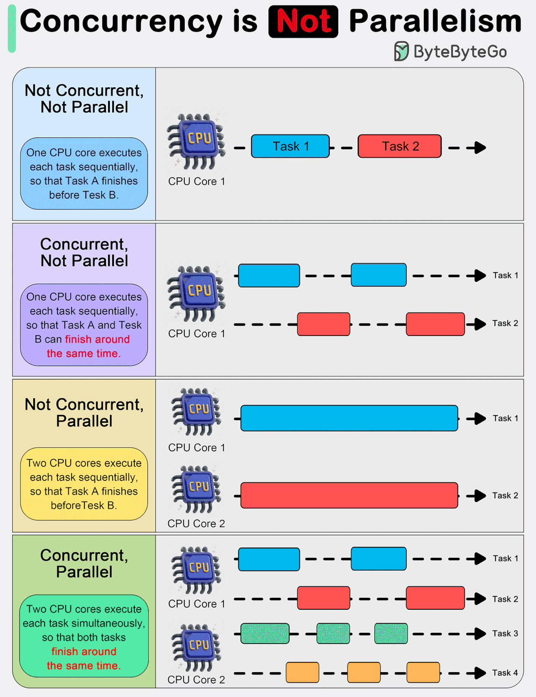

## Concurrency VS Parallelism ⚔️

As Rob Pyke(one of the creators of GoLang) stated:“ Concurrency is about 𝐝𝐞𝐚𝐥𝐢𝐧𝐠 𝐰𝐢𝐭𝐡 lots of things at once. Parallelism is about 𝐝𝐨𝐢𝐧𝐠 lots of things at once." This distinction emphasizes that concurrency is more about the 𝐝𝐞𝐬𝐢𝐠𝐧 of a program, while parallelism is about the 𝐞𝐱𝐞𝐜𝐮𝐭𝐢𝐨𝐧.

Concurrency is about dealing with multiple things at once. It involves structuring a program to handle multiple tasks simultaneously, where the tasks can start, run, and complete in overlapping time periods, but not necessarily at the same instant.

Concurrency is about the composition of independently executing processes and describes a program's ability to manage multiple tasks by making progress on them without necessarily completing one before it starts another.

Parallelism, on the other hand, refers to the simultaneous execution of multiple computations. It is the technique of running two or more tasks or computations at the same time, utilizing multiple processors or cores within a computer to perform several operations concurrently. Parallelism requires hardware with multiple processing units, and its primary goal is to increase the throughput and computational speed of a system.

In practical terms, concurrency enables a program to remain responsive to input, perform background tasks, and handle multiple operations in a seemingly simultaneous manner, even on a single-core processor. It's particularly useful in I/O-bound and high-latency operations where programs need to wait for external events, such as file, network, or user interactions.

Parallelism, with its ability to perform multiple operations at the same time, is crucial in CPU-bound tasks where computational speed and throughput are the bottlenecks. Applications that require heavy mathematical computations, data analysis, image processing, and real-time processing can significantly benefit from parallel execution.

