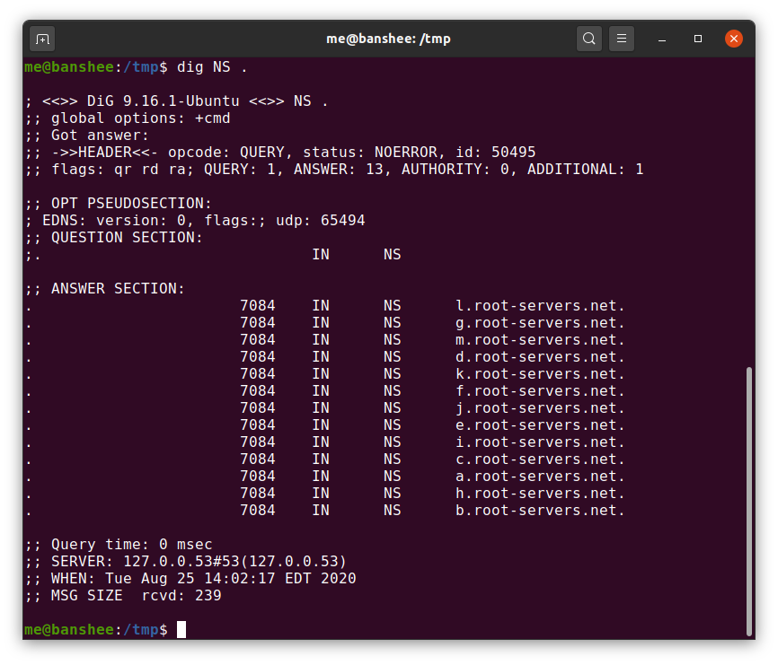

## What happens when you type a URL in your browser?


=> আমরা যখন আমাদের ব্রাউজারের এড্রেস বারে URL টাইপ করে Enter প্রেস করি, তখন ব্রাউজারের স্ক্রিনে সেই টাইপ করা সাইটটি দেখতে পাই। কিন্তু Enter প্রেস করার পর এবং নির্দিষ্ট সাইট থেকে ইনফরমেশন আসার মধ্যে কী ঘটে, তা হয়তো আমরা জানি না।

::: details image

:::
যখন URL type করে enter press করা হয়,তখন ব্রাউজার এই রিকুয়েষ্ট কে DNS server এ পাঠিয়ে দেয়। DNS server এই রিকুয়েষ্ট সলভ করে মূলত DNS resolution এর মাধ্যমে। প্রশ্ন আসতে পারে, DNS resolution কি? ইন্টারনেটে যেকোনো সাইট মূলত আইপি এড্রেস দিয়ে ট্রাকিং হয়। যেমন google.com এর আইপি `17.53.21.253`। মানুষের জন্য আইপি এড্রেস মনে রাখা কঠিন হওয়ায়, প্রতিটি আইপি এর Against এ একটি unique human readable ডোমেইন দেয়া হয়। এটা অনেকটা, একটা ক্লাসের ছাত্রদের রোলনম্বর এবং রোলনম্বরের সাপেক্ষে নামের মতো কাজ করে।

অর্থাৎ, যে কোনো ডোমেইন নামকে প্লেইন ইংলিশ থেকে আইপি অ্যাড্রেসে কনভার্ট করার প্রক্রিয়াকেই DNS রেজোলিউশন বলা হয়। এবং এই কনভার্শনটি ব্রাউজারের জন্য জরুরি, কারণ এটি অন্য সার্ভারের সাথে সংযোগ স্থাপন করতে সাহায্য করে।

এখন প্রশ্ন হচ্ছে, DNS কিভাবে প্রতিটি ডোমেইন নেইমনের এগেইস্ট এ আইপি খুঁজে বের করে? এটা হয় DNS lookup এর মাধ্যমে। আমরা অনেকে c++ এর map পড়েছি। map যেমন key value pair রাখে, ঠিক তেমনি আমাদের domain আর এর আইপি key value pair হিসেবে থাকে। এই খুঁজে বের করাটা হয় মূলত root DNS সার্ভার থেকে। root DNS server হচ্ছে সকল ইনফরমেশন এর রুট, এবং root server থেকে অনেকগুলো লেভেল থাকে, আমরা সেইসব কিভাবে DNS কাজ করে সেখানে পড়বো।
::: details image

:::

DNS আইপি রিটার্ন করার পর, ব্রাউজার 3-way handshake মাধ্যমে আইপি অ্যাড্রেসের সার্ভারের সাথে TCP কানেকশন তৈরি করে। (যদি কানেকশন HTTPS প্রোটোকল হয়, তবে কানেকশন সিকিউর করতে সার্টিফিকেট আদান-প্রদান হয়, এই বিষয়ে আমরা "How SSL certificate works" অংশে বিস্তারিত জানব)
::: details image

:::
::: tip 4 events
১. A → B: A, B-কে একটি SYN প্যাকেট পাঠায়, যেখানে A-এর Initial Sequence Number (ISN) x হিসেবে সেট করা থাকে। Acknowledgement Number ০ (শূন্য) থাকে।

২. A ← B: B, A-এর SYN প্যাকেটটি গ্রহণ করে এবং A-কে জানায় যে, সে x+1 পর্যন্ত প্রস্তুত, অর্থাৎ B A-এর SYN প্যাকেটটি গ্রহণ করেছে এবং তার নিজস্ব Sequence Number (ISN) প্রস্তুত।

৩. A ← B: TCP একটি দুইমুখী প্রোটোকল হওয়ায়, B নিজেও A-কে একটি SYN প্যাকেট পাঠায়, যেখানে B-এর ISN y হিসেবে সেট করা থাকে।

৪. A → B: A, B-এর SYN প্যাকেটটি গ্রহণ করে এবং জানায় যে, সে y+1 পর্যন্ত প্রস্তুত, অর্থাৎ A B-এর SYN প্যাকেটটি গ্রহণ করেছে এবং তা নিশ্চিত করেছে।

:::

TCP কানেকশন এস্টাবলিশমেন্টের পর, ব্রাউজার রিকুয়েষ্ট সেন্ড করে। এখন প্রশ্ন উঠতে পারে, রিকুয়েষ্ট কিভাবে সেন্ড হয়? ব্রাউজার মূলত রিকুয়েষ্টটিকে HTTP specification অনুযায়ী কম্পাইল করে এবং তারপর সার্ভারে পাঠায়। রিকুয়েষ্ট দেখতে এমন-

```
GET /api/search?q=home HTTP/1.1
HOST: www.google.com
Connection: keep-alive
```

HOST এবং Connection কে একসাথে বলা হয় Headers।
Headers মূলত

- `instructions to server + metadata`

এখন প্রশ্ন হচ্ছে, সার্ভার আমাদের ব্রাউজারের রিকুয়েষ্ট পেলো,কিন্তু কিভাবে সে রিকুয়েষ্ট টা সলভ করে রেসপন্স পাঠায়?
সার্ভার এইখানে ডাটার জন্য প্রয়োজন অনুসারে লোকাল ডিস্ক থেকে ফাইল লোড করতে পারে অথবা কল করতে পারে ডাটাবেইজ এ, ইনফরমেশন গেট করার জন্য, অথবা ইরর থ্রো করতে পারে যদি malformed হয়।

সাভার যখন প্রোসেসিং শেষ করে, রেসপন্স কমপাইল করে http রেসপন্স এ কনভার্ট করে ফেরত পাঠায়। রেসপন্স টা দেখতে এমন-

```
HTTP/1.1 200 ok
Content-Type:text/html
Content-length:2092

<html><head>
```

ব্রাউজার এই HTTP রেসপন্স টা একসেপ্ট করে

```
HTTP/1.1 200 ok................. status code
Content-Type:text/html.......... type
Content-length:2092............. length

<html><head>.................... body
```

::: info footnote
এখন যদি প্রশ্ন আসে, আচ্ছা যদি content তে html না এসে pdf আসে তাহলে কি হবে? তখন ব্রাউজার জানবে না কিভাবে রেন্ডার হবে, তাই ব্রাউজার ফাইল ডাউনলোড করে নিবে।
Html render হওয়ার পর, ব্রাউজার এর পর-
১. CSS ফাইল লিংকড করে।
২.img লোড করে এবং রেন্ডার করে
৩.এবং সবশেষ javascript execute করে।
:::

## How DNS really works and how it scales infinitely?

::: details image

:::

==> আমাদের যেকোনো মেশিনের সাথে contract করার জন্য প্রয়োজন হয় IP address এর। তাই আমরা ব্রাউজারে www.google.com টাইপ করলেও, ব্রাউজারের আইপি এড্রেস এর প্রয়োজন পড়ে TCP connection এস্টাবলিশমেন্টের জন্য। আর এই পুরো প্রসেস টাকে বলা হয় DNS resolution।

ধরা যাক, ব্রাউজারে টাইপ করা হলো, www.google.com, এবং গুগলের আইপি এড্রেস 17.53.21.253। এখন প্রশ্ন হচ্ছে ব্রাউজার কিভাবে জানে গুগলের আইপি 17.53.21.253? কোনো একজায়গায় এই ডোমেইন এবং আইপি এড্রেস এর ম্যাপিং টা স্টোর করে রাখা লাগবে।
::: details image

:::

এখন এই ম্যাপিং সার্ভ করার দুটো ওয়ে আছে।

- ১. `সেন্ট্রালাইজেশন এপ্রোচ`: একমন একটা বিশাল সিস্টেম, যেখানে যে কেউ রিকুয়েষ্ট করতে পারে যে কোনো ডোমেইন এর জন্য। বাট এই সেন্ট্রালাইজড সিস্টেম এর সমস্যা হলো, এটা স্কেলেবল না, ফল টোলারেন্ট না, এমনকি মেনেজেবল ও না।
- ২. `ডিসেন্ট্রালাইজেশন এপ্রোচ`: এই এপ্রোচে একটা কম্পোনেন্টের নাম আসে সেটা হলো DNS resolver। এই DNS resolver ই মূলত DNS resolution ঘটায়।

এই DNS resolver যেকোনো জায়গায় রান করতে পারে। একটা পপুলার জায়গা হলো ISP level। তারমানে আমরা যখন ব্রাউজার থেকে রিকুয়েষ্ট পাঠাই, তখন সেই resolution handle করে ইন্টারনেট সার্ভিস প্রোভাডার এর সার্ভার।
আমাদের বাসায় রাউটার ও এই resolution handle করতে পারে।

তাহলে সংক্ষেপে দাড়ায়, ব্রাউজার রিকুয়েষ্ট পাঠায়, সেই রিকুয়েষ্ট রাউটার অথবা ISP level এর dns resolver এর কাছে যায়, যদি এদের কাছে ip address থাকে ডোমেইন নেইমের এগেইস্ট এ, সেই আইপি ব্যাক পাঠায়, আর যদি না থাকে পুরো resolution প্রসেস টা ঘটে, ip Cache করে রাখে এবং ব্রাউজারের কাছে রেসপন্স পাঠায়।

এখন প্রশ্ন হচ্ছে, এই DNS resolution প্রসেস টা কেমন?
ধরা যাক, আমাদের রিকুয়েষ্ট এবং রেসপন্স এর মাঝে কোনো caching নেই। তাহলে ব্রাউজারে যদি টাইপ করা হয় www.google.com এর কোনো caching নেই, এবং resolution handle করছে রাউটার। তাহলে এই রাউটার এখন কিভাবে resolution handle করে সেটা জানা যাক।

রাউটার প্রথমে root name server এর সাথে যোগাযোগ করবে। পৃথিবীতে মোটমিলে ১৩ টি root name server রয়েছে। ( প্রতিটি root name server একেক কোম্পানি own করে)।

::: details image

:::

এখন প্রশ্ন আসতে পারে, যেহেতু পুরো ওয়ার্লন্ড এ কেবল ১৩ টি root name server থাকে, তাহলে তো সেই প্রথম সমস্যাটাই আবার হবে, প্রচুর মানুষ অ্যাক্সেস করতে চাবে, এবং সাভার এর উপর প্রচুরর চাপ পড়বে। এইখানে একটা বিষয় জেনে রাখা লাগবে এই প্রত্যেকটা server কেবল একটা ফিজিক্যাল সাভার নয়, অনেকগুলো distributed অবস্থায় থাকে, এবং সবগুলো একই আইপি broadcast করে। অর্থাৎ ১৩ টির যেকোনো একটির সার্ভার সংখ্যাই অনেক, কিন্তু সবগুলো সেই একটারই ip broadcast করে।

তাহলে সহজে বলা চলে, যখন কোনো পিসি কোনো সাইটের আইপির জন্য ১৩ টি রুট নেম সার্ভারের যেকোনো একটি reachout করবে, কিন্তু সে সংযোগ করবে ১৩ টির যেকোনো একটির nearest physical server, যেটা সেই আইপি broadcast করছে।

এখন ধরা যাক, আমাদের রাউটার closest root name server এর সাথে কানেক্টেড হলো, এরপর কি হয়। সার্ভার এরপর রেসপন্স পাঠায় আরকটি সার্ভার এর IP, যেটা টপ লেভেল ডোমেইন ম্যানেজ করে। এবং ব্রাউজার গুগল এর আইপি পেয়ে থাকে।
::: details image

:::

সবশেষে প্রশ্ন থেকে যায়,তাহলে কি সবাই root name server এ সবসময় আইপি খুজার জন্য রিকুয়েষ্ট পাঠায়? না, সব সময় পাঠানো লাগে না।আমাদের ব্রাউজার, operating system, ISP server অনেক সময় এই domain-ip ক্যাশ করে রাখে। যার কারণে বেশিরভাগ সময়ই রিকুয়েষ্ট রুট সার্ভার পর্যন্ত যায় না।

## How SSL Certificate Works? - HTTPS Explained

HTTP কানেকশনের ক্ষেত্রে, TCP 3-way handshake সম্পন্ন হওয়ার পর ব্রাউজার সরাসরি সার্ভারের কাছে রিকোয়েস্ট পাঠায়। সমস্যাটি হলো, এই রিকোয়েস্টে কোনো ধরনের সিকিউরিটি থাকে না, ফলে Man-in-the-Middle Attack হওয়ার ঝুঁকি থাকে।

::: details image

:::
এই নিরাপত্তা সমস্যার সমাধান হিসেবে ব্যবহৃত হয় HTTPS প্রোটোকল, যেখানে সিকিউরিটি নিশ্চিত করতে SSL Certificate ব্যবহার করা হয়।

এখন রিকোয়েস্ট এবং রেসপন্সকে সিকিউর করতে হবে। সিকিউর করার জন্য প্রথমেই মাথায় আসে এনক্রিপশন। এনক্রিপশন মূলত দুই প্রকারের: সিমেট্রিক এবং এসিমেট্রিক।

সিমেট্রিক এনক্রিপশন-এ সার্ভার এবং ক্লায়েন্ট উভয়ের কাছে একই কী থাকে, যা দিয়ে ডাটা এনক্রিপ্ট ও ডিক্রিপ্ট করা হয়। সমস্যা হলো, যখন সার্ভার কী জেনারেট করে ক্লায়েন্টকে পাঠায়, তখন মাঝপথে হ্যাকার কী-এর কপি রাখার সম্ভাবনা থাকে। তাই সিমেট্রিক এনক্রিপশন সরাসরি ব্যবহার করা নিরাপদ নয় এবং সাধারণ ডাটা ট্রান্সফারের ক্ষেত্রে এটি ব্যবহার করা হয় না।

::: details image

:::

এর বদলে, এসিমেট্রিক এনক্রিপশন ব্যবহৃত হয়, যা আরও নিরাপদ পদ্ধতি হিসেবে কাজ করে।

এসিমেট্রিক এনক্রিপশন-এ দুইটি কী থাকে: একটি পাবলিক কী এবং একটি প্রাইভেট কী। পাবলিক কী যে কোনো ডেটাকে এনক্রিপ্ট করতে পারে, এবং সেই এনক্রিপ্ট করা ডেটা শুধুমাত্র প্রাইভেট কী দিয়ে ডিক্রিপ্ট করা যায়। অর্থাৎ একই কী দিয়ে এনক্রিপ্ট এবং ডিক্রিপ্ট করা সম্ভব নয়।

এখন দেখা যাক, এসিমেট্রিক পদ্ধতিতে ডেটা কতটা সিকিউর থাকে।

- **সার্ভার কী জেনারেশন**: সার্ভার প্রথমে দুটি কী জেনারেট করে: একটি পাবলিক কী এবং একটি প্রাইভেট কী।

- **পাবলিক কী শেয়ারিং**: সার্ভার তার পাবলিক কী ক্লায়েন্টকে পাঠায়। ধরুন হ্যাকারও মাঝপথে এই পাবলিক কী কপি করতে সক্ষম হয়েছে।

- **ক্লায়েন্ট কী জেনারেশন**: ক্লায়েন্ট নিজের একটি symmetric কী জেনারেট করে (ছবিতে সবুজ কী) এবং তার symmetric কী সার্ভারের পাঠানো পাবলিক কী দিয়ে এনক্রিপ্ট করে।

- **ক্লায়েন্ট থেকে সার্ভারে পাঠানো**: ক্লায়েন্ট তার এনক্রিপ্ট করা symmetric পাবলিক কী সার্ভারে পাঠায়। যদিও হ্যাকার এই এনক্রিপ্টেড কী পেয়ে গেছে, কিন্তু তা ডিক্রিপ্ট করতে পারবে না, কারণ ডিক্রিপ্ট করার জন্য প্রয়োজন সার্ভারের প্রাইভেট কী, যা হ্যাকারের কাছে নেই।

- **ডেটা ট্রান্সফার**: সার্ভারের কাছে ক্লায়েন্টের ডিক্রিপ্ট করা কী পৌঁছে গেছে। এখন ক্লায়েন্ট যেকোনো ডেটা নিজের জেনারেট করা কী দিয়ে এনক্রিপ্ট করে সার্ভারকে পাঠায়। সার্ভার সেই একই কী দিয়ে ডেটা ডিক্রিপ্ট করে নিতে পারে।

এই প্রক্রিয়ার মাধ্যমে ডেটা নিরাপদভাবে সার্ভার এবং ক্লায়েন্টের মধ্যে ট্রান্সফার হয়।

::: details image

:::

বাট, এই পদ্ধতিতেও সমস্যা রয়েছে।
এইখানে হ্যাকার একটা প্রক্সি এর মতো আচরণ করতে পারে। সার্ভার যখন ক্লায়েন্ট কে পাবলিক কী পাঠায়, তখন হ্যাকার সেই পাবলিক কী রেখে, নিজের তৈরি একটি পাবলিক কী ক্লায়েন্টকে পাঠাবে। এখন ক্লায়েন্ট ভাববে, তাকে কী টি সার্ভার পাঠিয়েছে, আদতে এই কী এসেছে হ্যাকারের কাছ থেকে। এখন ক্লায়েন্ট আগের মতো সেই কী(হ্যাকারের পাঠানো কী) দিয়ে নিজের পাবলিক কী এনক্রিপ্ট করবে এবং সার্ভার পাঠাবে, মাঝপথে হ্যাকার সেই এনক্রিপ্ট করা কী সহজেই ডিক্রিপ্ট করে নিতে পারবে এবং সেই কী ইচ্ছে হলে সার্ভার ফরোয়ার্ড করবে অথবা নিজের বানানো আরেকটি কী ফরোয়ার্ড করতে পারবপ। এইভাবে হ্যাকার যেকোনো এনক্রিপ্ট করা মেসেজ ডিক্রিপ্ট করতে পারবে, কারণ এনক্রিপ্ট করার কী তার থেকে নিয়েছে ক্লায়েন্ট।

::: details image

:::

এখন এই সমস্যার সমাধানের জন্যই মূলত SSL Certificate ব্যবহৃত হয়। এখন দেখা যাক ssl certificate কিভাবে কাজ করে-

সার্ভার দুটো কী জেনারেট করে, পাবলিক কী ও প্রাইভেট কী। সার্ভার, ক্লায়েন্টের কাছে নিজেকে ভ্যারিফাই করার জন্য প্রয়োজন পরে সাটিফিকেটের। আর এই সাটিফিকেট ইস্যু করে থার্ড পার্টি সার্ভিস `lets encrypt`। এখন Let’s Encrypt সার্ভারকে তার পাবলিক কী পাঠাতে বলবে। এখানে Let’s Encrypt মূলত issuer হিসেবে কাজ করছে। সার্টিফিকেট তৈরির জন্য Let’s Encrypt নিজস্ব একটি পাবলিক কী এবং প্রাইভেট কী জেনারেট করবে। এরপর Let’s Encrypt সার্ভারের জন্য একটি সার্টিফিকেট তৈরি করবে। সেই সার্টিফিকেট এ certificate issuer, সার্ভার থেকে আসা পাবলিক কী attached করে দিবে। এই সাটিফিকেট কে সিকিউর করার জন্য lets encrypt সাটিফিকেটে একটি সিগনেচার দিবে। সিগনেচারের ফর্মূলা হলো-

`signature = server public key + lets encrypt public key`

::: details image

:::

এই সিগনেচার সার্টিফিকেট এর সাথে attached করে দেয়া হয়। এরপর এই সার্টিফিকেট সার্ভারের কাছে পাঠানো হয়।
এখন কানেকশন স্থাপনের সময় সার্ভার ক্লায়েন্টের কাছে তার পাবলিক কী-এর সাথে সার্টিফিকেটও পাঠাবে, যাতে করে ক্লায়েন্ট পাবলিক কী অরিজিনালি সার্ভার থেকে আসছে কিনা তা চেক করতে পারে (মাঝপথে হ্যাকার কী চেইঞ্জ করে নাই)। কী চেক করার জন্য ক্লায়েন্টকে সিগনেচার ম্যাচ করতে হবে, এবং আমাদের জানা আছে সিগনেচার জেনারেট হয়েছে মূলত সার্ভারের পাবলিক কী এবং certificate issuer এর পাবলিক কী দিয়ে। তাই ক্লায়েন্ট certificate issuer এর কাছে চাইবে তার পাবলিক কী যাতে ক্লায়েন্ট কে দেয়। দুটো পাবলিক কী পাওয়ার পর ক্লায়েন্ট চেক করতে পারবে যদি signature correct হয়, তার মানে সার্ভার এর পাঠানো পাবলিক কী ভ্যালিড( মাঝপথে চেইঞ্জ হয় নি)। এর পর সব procedure asymmetric এর মতো, ক্লায়েন্ট তার জেনারেটেড পাবলিক কী কে, সার্ভার এর পাঠানো পাবলিক কী দিয়ে এনক্রিপ্ট করবে....
