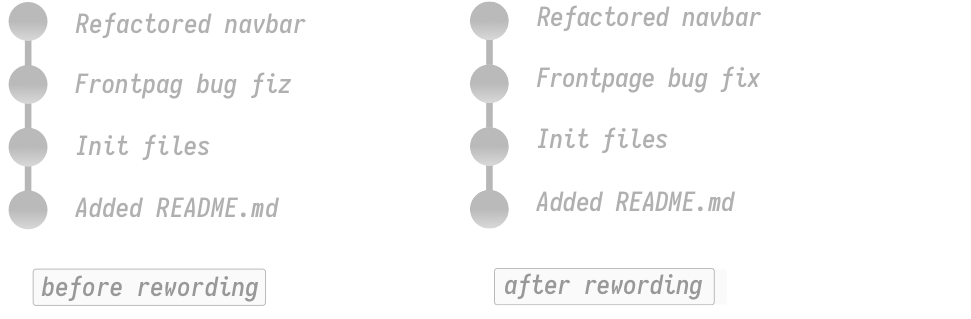
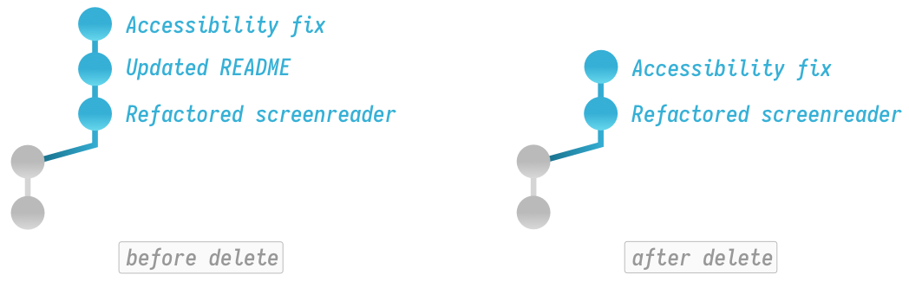
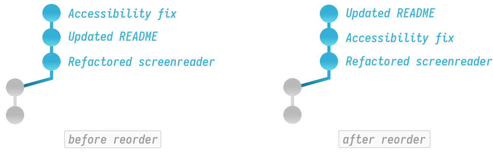
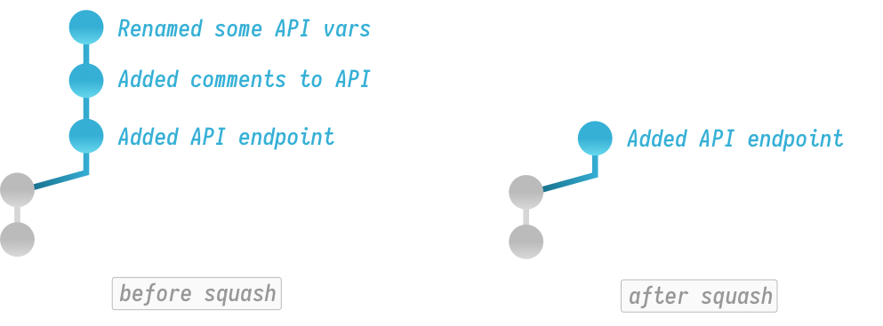
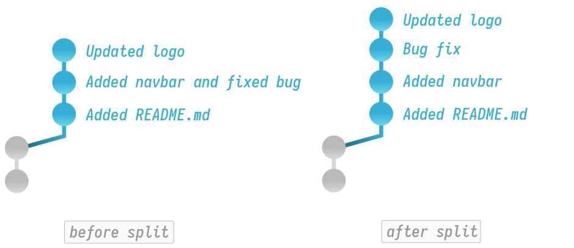

# Techniques for Rewriting Git History

::: danger Caution
Changing history (with `--amend`, `rebase`, or `--force`) can have nasty side effects. If you need to change commits that already exist on GitHub, proceed with caution!
:::

---

## Amending Commits


Amending refers to either adding files to, or removing files from a commit. Amend can also be used to change a commit's log message, but today I want to use it to add files to a commit.

As an example: if I run `git status` you can see that I have 2 files that would really like to belong in my latest commit.

```text
Changes not staged for commit:
  (use "git add <file>..." to update what will be committed)
  (use "git checkout -- <file>..." to discard changes in working directory)

        modified:   about_me.css
        modified:   profile_pic.jpg
```

To get started, I'll first need to stage my files.

```bash
git add about_me.css profile_pic.jpg
```

Then I'll use amend to add those staged changes to my most recent commit:

```bash
git commit --amend --no-edit
```

::: tip
The `--no-edit` flag tells Git that you'd like to leave the commit message of your latest commit unchanged. If you want to update the commit message, remove this flag.
:::

That's all there is to it.

---

## Rewording Commit Messages



What if you want to reword a commit message? Enter interactive rebase and its plethora of options. I'll start by telling Git I want to enter interactive rebase and operate upon the last 2 commits back from HEAD.

```bash
git rebase -i HEAD~2
```

Git will then open up my default terminal text editor (most likely vim) and present me with a file that I'll need to edit.

```text
pick 7f9d4bf Frontpag bug fiz
pick 3f8e810 Refactored navbar

# Rebase 4095f73..ec48d74 onto 4095f73 (3 commands)
#
# Commands:
# p, pick <commit> = use commit
# r, reword <commit> = use commit, but edit the commit message
# ...
```

As you can see, at the top, there is a list of commits, and a big comment section explaining all the different options. Right now I just want to fix that spelling mistake in the first commit. To start, I'll change the prefix of that commit from `pick` to `reword` (If you're using vim, type `i` to enter insert mode).

```text
reword 7f9d4bf Frontpag bug fiz
pick 3f8e810 Refactored navbar
```

Then I'll save and close the file. (Again, in vim press `ESC` then type `:wq` to save and exit the file). At this point Git will pop up another file where I can rename the commit message. I'll simply edit this file with the reworded commit message.

```text
Frontpage bug fix
```

After I'm done making my changes to the commit message, I'll simply save and close the file to finalize the spelling changes.

---

## Deleting Commits



As you saw from the rewording example, interactive rebase has many more options, so let's dive into some. Say I'd like to remove a commit from my history.

I'll start by opening interactive rebase again, but this time I'll operate on the last three commits.

```bash
git rebase -i HEAD~3
```

```text
pick 2f8e823 Refactored screenreader attributes
pick 7f9d4bf Updated README
pick 3f8e810 Accessibility fix

# Rebase 4095f73..ec48d74 onto 4095f73 (3 commands)
#
# Commands:
# p, pick <commit> = use commit
# r, reword <commit> = use commit, but edit the commit message
# ...
```

To remove a commit, I simply find the commit I'd like gone and change its prefix from `pick` to `drop`.

```text
pick 2f8e823 Refactored screenreader attributes
drop 7f9d4bf Updated README
pick 3f8e810 Accessibility fix
```

Again, I'll save and quit the file and the commit is gone.

---

## Reordering Commits



Reordering commits is just as easy. We'll enter interactive rebase again:

```bash
git rebase -i HEAD~2
```

```text
pick 7f9d4bf Updated README
pick 3f8e810 Accessibility fix

# Rebase 4095f73..ec48d74 onto 4095f73 (3 commands)
#
# Commands:
# p, pick <commit> = use commit
# r, reword <commit> = use commit, but edit the commit message
# ...
```

To reorder, I'll simply change the order of commits by reordering their lines at the top of the file.

```text
pick 3f8e810 Accessibility fix
pick 7f9d4bf Updated README
```

::: warning
Be careful here, if you delete a commit line and save this file without putting it back, Git will destroy the commit entirely.
:::

I'll once again save and quit to finalize the reordering.

---

## Squashing Commits



Now let's get into some fun stuff. Say I want to meld my previous 2 commits into one. We'll once again use interactive rebase…

```bash
git rebase -i HEAD~3
```

```text
pick 7f9d4bf Added API endpoint
pick 3f8e810 Added comments to API
pick ec48d74 Renamed some API vars

# Rebase 4095f73..ec48d74 onto 4095f73 (3 commands)
#
# Commands:
# ...
# s, squash <commit> = use commit, but meld into previous commit
# f, fixup <commit> = like "squash", but discard this commit's log message
# ...
```

As you can see (above) Git provides two options for combining commits: `squash` and `fixup`. Both options do pretty much the same thing, except `squash` will kick you to an extra screen which allows you to edit the commit messages. I have a whole other article that goes into greater detail on the squash workflow, so for now I don't care about preserving those other log messages.

I'll change `pick` to `fixup` which indicates to Git that I want to meld this commit into the previous one then discard its log message.

```text
pick 7f9d4bf Added API endpoint
fixup 3f8e810 Added comments to API
fixup ec48d74 Renamed some API vars
```

Now I'll save and quit this file. As you can see, I've ended up with a new squashed commit which contains the contents of all 3 previous commits.

```bash
git log --oneline
```

```text
617ebc5 (HEAD -> my_branch) Added API endpoint
```

---

## Splitting Commits



Lastly, let's talk about splitting commits. Down the line you may decide certain changes would be better off as separate commits and that's what splitting is all about.

```bash
git log --oneline
```

```text
3f8e810 Updated logo
ec48d74 Added navbar and fixed bug
2bf910f Added README
```

As you can see above, I'd really prefer if the second commit was split up. To make this happen, I'll enter interactive rebase once again.

```bash
git rebase -i HEAD~3
```

```text
pick Added README
pick Added navbar and fixed bug
pick Updated logo

# Rebase 4095f73..ec48d74 onto 4095f73 (3 commands)
#
# Commands:
# p, pick <commit> = use commit
# r, reword <commit> = use commit, but edit the commit message
# ...
```

As you might guess, the splitting process is a bit more complicated than our previous operations, but don't worry, I'll break it down. First, we need to tell Git which commit we want to change. In this case I want to split the second commit so I'll change its keyword from `pick` to `edit`.

```text
pick Added README
edit Added navbar and fixed bug
pick Updated logo
```

Next, I'll save and close the file. When I do this, Git will start executing any rebase operations I specified. Since I left the other commits alone, Git will do nothing to those; however, when it comes to the commit for which I specified `edit`, Git will pause the rebase operation and allow me to make changes.

```text
Stopped at f124bc5... Added navbar and fixed bug
You can amend the commit now, with

    git commit --amend

Once you are satisfied with your changes, run

    git rebase --continue

jacklot in ~/dev/my_site6 (git)-[my_branch|rebase-i]-
```

As you can see above, Git dropped me back to the terminal on a special rebasing branch. I can now type commands that will modify our commit. To split this commit, I'll first want to undo the commit by unstaging all the files.

```bash
git reset HEAD^
```

If I run `git status` you can see I have 3 files that are now unstaged and ready to be re-committed:

```text
Untracked files:
  (use "git add <file>..." to include in what will be committed)

        analytics.js
        navbar.css
        navbar.html
```

Now I can re-commit the files using the normal add and commit workflow as below:

```bash
git add navbar.css navbar.html
git commit -m 'Added navbar'
git add analytics.js
git commit -m 'Fixed bug'
```

After I'm done re-committing all my files, I'll just tell Git to continue:

```bash
git rebase --continue
```

That's it. Now if I take a look at my history, you can see I've ended up with 4 commits after splitting:

```bash
git log --oneline
```

```text
3f8e810 Updated logo
ur48d47 Fixed bug
4c59d82 Added navbar
2bf910f Added README
```
