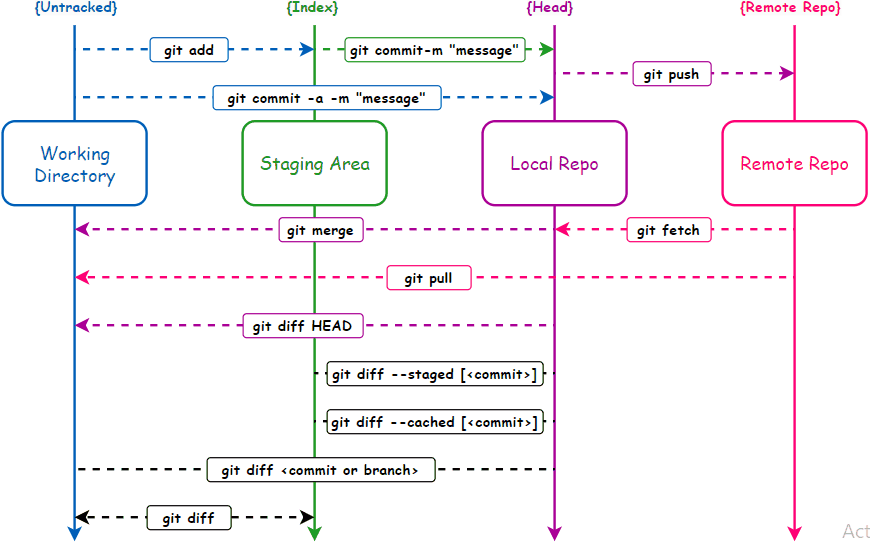

# Git Cheat sheet

## Configure tooling

```console
$ git config --global user.name "[name]"
```

> Sets the name you want attached to your commit transactions

```console
$ git config --global user.email "[email address]"
```

> Sets the email you want attached to your commit transactions

```console
$ git config --global color.ui auto
```

> Enables helpful colorization of command line output

## Branches

Branches are an important part of working with Git. Any commits you make will be made on the branch you are currently "checked out" to. Use `git status` to see which branch that is.

```console
$ git branch [branch-name]
```

```console
$ git checkout [branch-name]
```

```console
$ git merge [branch]
```

```console
$ git branch -d [branch-name]
```

## Create repositories

when starting with a new repository ,you need to do it once; either locally ,then push to github ,or by cloning an existing repository.

```console
$ git init
```

```console
$ git clone
```

## Synchronize changes

Synchronize your local repository with the remote repository
on GitHub.com

```console
$ git fetch
```

```console
$ git merge
```

```console
$ git push
```

```console
$ git pull
```

::: details

```console
Updates your current local working branch with all new
commits from the corresponding remote branch on GitHub.
`git pull` is a combination of `git fetch` and `git merge`
```

:::

## Make changes

Browse and inspect the evolution of project files

```console
$ git log
```

```console
$ git log --follow [file]
```

```console
$ git diff [first-branch]...[second-branch]
```

```console
$ git show [commit]
```

```console
$ git add [file]
```

```console
$ git commit -m "[descriptive message]"
```

## Redo commits

Erase mistakes and craft replacement history

```console
$ git reset [commit]
```

```console
$ git reset --hard [commit]
```

::: danger CAUTION!
Changing history can have nasty side effects. If you
need to change commits that exist on GitHub (the remote),
proceed with caution. If you need help, reach out at
github.community or contact support.
:::

## Git Workflow Diagram



