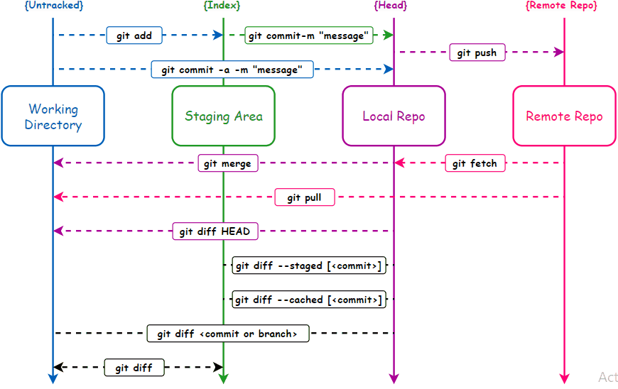

# Git & GitHub: From Zero to Pro

> A comprehensive guide to learn Git and GitHub from scratch.

---

## 📌 What is Git & GitHub?

**Git** is a version control system that tracks changes in your code. Think of it as a time machine for your project — you can save snapshots (called **commits**) and travel back to any previous version.

**GitHub** is a cloud service that lets you save your Git repositories online. It helps you:
- 🔒 **Backup** your code in case you lose it locally
- 📜 **View history** of all code changes easily
- 👥 **Collaborate** with teammates through pull requests

::: tip Key Terms
- **Repository (Repo)** = A folder containing code where changes are tracked by Git
- **Local Repository** = A Git repository saved on your computer
- **Remote Repository** = A Git repository saved online (e.g., on GitHub)
:::

---

## 🖥️ Command Line Basics

Before diving into Git, you need to know these basic terminal commands:

| Command | Description |
|---------|-------------|
| `ls` | List all files and folders in the current directory |
| `cd ~/Desktop/folder` | Change to a different directory |

::: warning Important
All Git commands must be run **inside the folder** that contains your code.
:::

---

## ⚙️ Initial Configuration

Before making commits, configure your identity:

```bash
# Set your name for commits
git config --global user.name "Your Name"

# Set your email for commits
git config --global user.email "your.email@example.com"

# Enable colorful output (optional but helpful)
git config --global color.ui auto
```

---

## 📦 Creating Commits

In Git:
- **Version** = Commit
- **Version History** = Commit History

### Initialize a Repository

```bash
# Start tracking changes in the current folder
git init

# Check current status (shows changes since last commit)
git status
```

### Stage Changes (Add to Staging Area)

```bash
# Add a specific file
git add filename.txt

# Add all files in a folder (and subfolders)
git add folder/

# Add ALL changed files
git add .
```

### Create a Commit

```bash
# Create a commit with a message
git commit -m "Your descriptive message here"

# Update the previous commit (instead of creating a new one)
git commit -m "Updated message" --amend
```

### View Commit History

```bash
# View commit history
git log

# View ALL commits (including other branches)
git log --all

# View commits with visual branching graph
git log --all --graph
```

---

## 🔄 Understanding Git Areas

Git has three main areas where your code lives:

```
┌─────────────────┐     git add      ┌─────────────────┐    git commit    ┌─────────────────┐
│  Working Area   │ ───────────────► │  Staging Area   │ ───────────────► │ Commit History  │
│ (Your changes)  │                  │ (Ready to save) │                  │   (Saved!)      │
└─────────────────┘                  └─────────────────┘                  └─────────────────┘
                     ◄───────────────
                        git reset
```

### Moving Between Areas

```bash
# Working → Staging
git add .

# Staging → Commit History
git commit -m "message"

# Staging → Working (unstage changes)
git reset file
git reset folder/
git reset .

# Discard changes in working area
git checkout -- file
git checkout -- folder/
git checkout -- .
```

---

## ⏪ Viewing Previous Commits

```bash
# View a specific commit
git checkout <commit_hash>

# View the latest commit of a branch
git checkout <branch_name>
```

::: info Understanding HEAD and Branches
- **HEAD** = Points to the commit you are currently viewing
- **Branch (e.g., main, master)** = Always points to the latest commit on that branch
:::

**Example commit history:**
```
commit 81491250a2a940babba4a3f69bec7aa2c87b782a (master)
Author: Your Name <your.email@example.com>
Date: Sat Feb 20 07:19:11 2021
    Version 3

commit 4fb1b33d86a825c517b0376ebd950111f98d0ada
Author: Your Name <your.email@example.com>
Date: Sat Feb 20 07:18:53 2021
    Version 2

commit 400e1ba797f732c94e290774aacfd4738c864db8 (HEAD)
Author: Your Name <your.email@example.com>
Date: Sat Feb 20 05:49:00 2021
    Version 1
```

---

## 🔧 Restoring to a Previous Commit

```bash
# Restore a specific file to a previous commit
git checkout <hash> file

# Restore all files in a folder
git checkout <hash> folder/

# Restore entire project to a previous commit
git checkout <hash> .
```

---

## 🛠️ Other Useful Git Features

### Create Shortcuts (Aliases)

```bash
# Create an alias
git config --global alias.s "status"

# Now you can use: git s (instead of git status)
```

### Ignore Files

Create a `.gitignore` file to tell Git which files/folders to ignore:

```bash
# Example .gitignore content
node_modules/
.env
*.log
```

### Remove Git from a Project

```bash
# Completely remove Git tracking
rm -rf .git
```

---

## ☁️ Uploading Code to GitHub

### Link Local to Remote Repository

```bash
# Link your local repo to a GitHub repo
git remote add origin https://github.com/username/repository.git

# List all linked remote repositories
git remote

# List with more detail
git remote -v

# Remove a remote link
git remote remove origin
```

### Configure GitHub Credentials

```bash
# Set your GitHub username
git config --global credential.username your-username
```

### Push Code to GitHub

```bash
# Upload a branch to remote repository
git push origin main

# Set up shortcut for future pushes
git push origin main --set-upstream

# Now you can just use:
git push

# Force push (overwrites remote — use with caution!)
git push origin main -f
```

---

## ⬇️ Downloading Code from GitHub

### Clone a Repository

```bash
# Download a repository
git clone https://github.com/username/repository.git

# Download with a custom folder name
git clone https://github.com/username/repository.git my-folder
```

### Fetch and Pull Updates

```bash
# Update remote tracking branches (doesn't modify your files)
git fetch

# Download AND merge updates from remote
git pull origin main

# Set up shortcut for future pulls
git pull origin main --set-upstream
```

::: tip git pull = git fetch + git merge
`git pull` downloads new commits AND merges them into your local branch automatically.
:::

---

## 🌿 Branching

Branching creates a copy of your version history that you can work on **without affecting the original**. This lets you work on multiple features simultaneously!

```bash
# List all branches
git branch

# Create a new branch
git branch feature1

# Switch to a branch
git checkout feature1

# Create AND switch to a new branch (shortcut)
git checkout -b feature1

# Delete a branch
git branch -D feature1
```

### Understanding HEAD with Branches

```
* commit 9bb22ff (HEAD -> feature1, master)
|   Version 3
|
* commit 8464f5b
|   Version 2
|
* commit 285addb
    Version 1
```

`HEAD -> feature1` means you're currently on the `feature1` branch. New commits will be added to this branch.

---

## 🔀 Merging Branches

Merging combines changes from one branch into another:

```bash
# First, switch to the branch you want to merge INTO
git checkout main

# Then merge another branch into it
git merge feature1 -m "Merge feature1 into main"
```

---

## ⚠️ Merge Conflicts

A merge conflict happens when Git doesn't know which changes to keep (e.g., two branches modified the same line).

### What a Conflict Looks Like

```
<<<<<<< HEAD
code from current branch
=======
code from branch being merged
>>>>>>> feature1
```

### How to Resolve

1. **Edit the file** — delete the conflict markers and keep the code you want:

```bash
# Before (conflict)
<<<<<<< HEAD
console.log("Hello");
=======
console.log("Hi there!");
>>>>>>> feature1

# After (resolved)
console.log("Hi there!");
```

2. **Repeat** for all conflicts in all files

3. **Create a commit** to save the resolution:

```bash
git add .
git commit -m "Resolved merge conflicts"
```

---

## 🚀 Feature Branch Workflow

This is a popular workflow used by professional development teams:

### Step 1: Create a Feature Branch

```bash
git branch new-feature
git checkout new-feature
```

### Step 2: Make Changes and Commit

```bash
# Make your code changes, then...
git add .
git commit -m "Add new feature"
```

### Step 3: Push Feature Branch to GitHub

```bash
git push origin new-feature
```

### Step 4: Create a Pull Request

On GitHub, create a **Pull Request (PR)** to let teammates review your code.

<!-- Screenshot: Creating a Pull Request -->

### Step 5: Merge the Pull Request

After approval, click **"Merge pull request"** on GitHub.

<!-- Screenshot: Merging Pull Request -->

### Step 6: Update Local Repository

```bash
git checkout main
git pull origin main
```

---

## 🔥 Handling Merge Conflicts in Feature Branches

If two PRs modify the same file/line, you'll get a merge conflict.

### Option 1: Resolve on GitHub
GitHub provides a web editor to resolve simple conflicts.

### Option 2: Resolve Locally

```bash
# 1. Get latest updates from main
git checkout main
git pull origin main

# 2. Get latest updates from feature branch
git checkout feature-branch
git pull origin feature-branch

# 3. Merge main INTO your feature branch
git merge main

# 4. Resolve conflicts in your editor, then:
git add .
git commit -m "Resolved conflicts with main"

# 5. Push resolved feature branch
git push origin feature-branch
```

Now your PR should be ready to merge! ✅

---

## 📊 Git Workflow Diagram



---

## 🎯 Quick Reference Cheat Sheet

| Task | Command |
|------|---------|
| Initialize repo | `git init` |
| Check status | `git status` |
| Stage all changes | `git add .` |
| Commit changes | `git commit -m "message"` |
| View history | `git log --all --graph` |
| Create branch | `git branch branch-name` |
| Switch branch | `git checkout branch-name` |
| Merge branch | `git merge branch-name` |
| Clone repo | `git clone <url>` |
| Push to remote | `git push origin main` |
| Pull from remote | `git pull origin main` |

---

::: danger CAUTION!
Changing history (with `--amend`, `reset`, or `--force`) can have nasty side effects. If you need to change commits that already exist on GitHub, proceed with caution!
:::

---

> **Credits:** Omar Faruk
